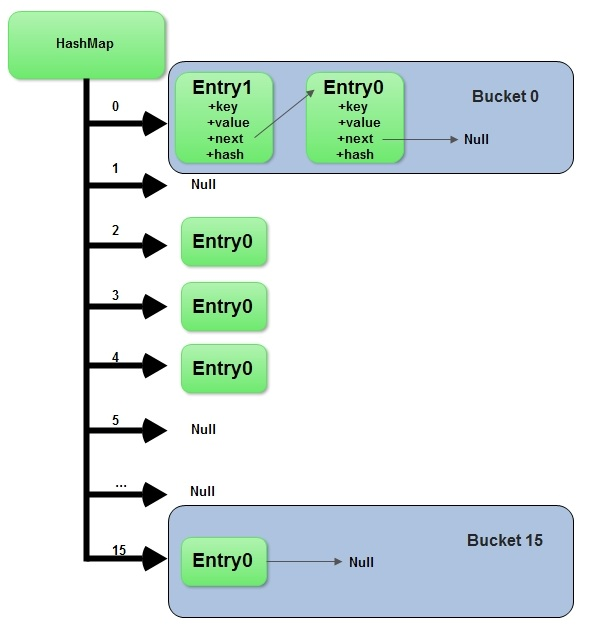

# HashMap源码-二次Hash与核心变量

## 1. 摘要

- HashMap内部使用一个```Node<K,V>[] table```存储所有的数据，此table内部的Node实例可能是链式的BinNode（即默认Node），或者TreeNode，相互转换的阈值为TREEIFY_THRESHOLD、UNTREEIFY_THRESHOLD和MIN_TREEIFY_CAPACITY，前两者为BinNode的链长阈值，后者为table大小阈值
    
- HashMap内部的table容量不够时，每次扩容到table.size*(1+loadFactor)向上取2的整数次幂，loadFactor默认0.75
- loadFactor越大，时间（put和get的时间)成本越高，越小，空间成本越高，默认的0.75是均衡的结果
- 内部存储值时，一般需要根据instanceof来判断调用BinNode还是TreeNode的方法，但考虑Treeify的概率小，因此某些方法实际上通过延迟判断来区分
- 树形态根据key的哈希码排序，但是当类实现了Comparable接口时，类的compareTo方法被调用来排序，在多个实例返回同样的hashCode的情况下，通过实现compareTo方法来提高效率
- TreeNode大小大概是普通Node的两倍

## 2. 默认常量

- DEFAULT_INITIAL_CAPACITY 初始化容量，16
- MAXIMUM_CAPACITY  最大容量，2的30次方
- DEFAULT_LOAD_FACTOR 扩容比例，0.75
- TREEIFY_THRESHOLD 树化阈值，HashMap将相同hash的K-V对存入某个Node中，默认是链状存储，当某个Node链长>=TREEIFY_THRESHOLD（且整个HashMap的capacity>MIN_TREEIFY_CAPACITY）时，需将Node转换为TreeNode以提升存取效率
- UNTREEIFY_THRESHOLD （树状转数组的阈值，默认6）
- MIN_TREEIFY_CAPACITY 最小转树状阈值，默认64

## 3. 关键方法

### 3.1. Key的哈希计算:hash(Object key)方法

众所周知，HashMap得名的原因是，通过根据key的某种哈希计算方式的数值&数组长度的方法来获取存储的位置，如果哈希计算方式不够分布，则哈希碰撞严重，导致每个Node的链过长或大量树化，则可能影响存储效率，因此，HashMap内部在key的hashCode()方法返回值基础上进行了额外的计算来尽量散布，减少碰撞。

```Java
static final int hash(Object key) {
        int h;
        return (key == null) ? 0 : (h = key.hashCode()) ^ (h >>> 16);
}
```

取的是key的hashCode()返回值高16位拼接高16位与低16位按位异或的结果，这么做的原因是:table中计算key对应存储位置的时候，使用的是(capacity-1)&hash，当容量小时，计算值左侧高N位全为0，如默认初始化容量为16时，相当于15&hash,也就是，000000000000000001111&hash,也就是key的hash值的后四bit决定是否碰撞，对于hashCode只在高位有区别的key类型（如小数点为0的Float），是大概率会碰撞的，因此计算hash时将高16位spread到低位去，可以在某些场景减少碰撞，下面是验证：

### 3.2. 二次哈希散布，理论验证

假设两个key分别为11111.0f和111111.0f，计算得两个key的hashCode返回分别为1000110001011011001110000000000，1000111110110010000001110000000

#### 3.2.1 直接计算:hashCode&(capacity-1)，capacity为16

11111.0f：

```textile
    1000110001011011001110000000000
&   0000000000000000000000000001111
    -------------------------------
    0000000000000000000000000000000
```

111111.0f:

```textile
    1000110001011011001110000000000
&   0000000000000000000000000001111
    -------------------------------
    0000000000000000000000000000000
```

发生哈希碰撞，实际上，即使容量为32，计算出的哈希仍旧为0，从上图可以看出，key的hashCode()仅有后几位参与计算，如果恰巧key的hashCode计算恰好后几位都是一致的，则产生哈希碰撞

#### 3.2.2 key的hashCode先高16位按位与低15位，后计算

11111.0f：

```textile
    1000110001011011001110000000000
&   0000000000000000100011000101101
&   0000000000000000000000000001111
    -------------------------------
    0000000000000000000000000000000
```

111111.0f:

```textile
    1000110001011011001110000000000
&   0000000000000001000110001011011
&   0000000000000000000000000001111
    -------------------------------
    0000000000000000000000000000000
```

效果一致

#### 3.2.3 key的hashCode按hash ^ (hash >>> 16)计算

11111.0f：

```textile
    1000110001011011001110000000000
^   0000000000000000100011000101101
    -------------------------------
    1000110001011011101101000101101
&   0000000000000000000000000001111
    -------------------------------
    0000000000000000000000000000010
```

111111.0f：

```textile
    1000110001011011001110000000000
^   0000000000000001000110001011011
    -------------------------------
    1000110001011010001000001011011
&   0000000000000000000000000001111
    -------------------------------
    0000000000000000000000000000100
```

不碰撞

#### 3.3. 自定义哈希散布，代码验证

```Java
    public static void main(String[] args) {
        Float f1 = 11111.0f;
        Float f2 = 111111.0f;
        int capacity = 16;
        System.out.println("f1的二进制："+Integer.toBinaryString(f1.hashCode()));
        System.out.println("f2的二进制："+Integer.toBinaryString(f2.hashCode()));
        System.out.println("HashMap630行，位置计算方式为(n - 1) & hash，假设当前容量为16\n若不进行spread，则：");
        int index1 = (capacity-1)&f1.hashCode();
        int index2 = (capacity-1)&f2.hashCode();
        System.out.println("位置1为:"+index1);
        System.out.println("位置2为:"+index2);
        System.out.println("发生碰撞\n若进行spread:");
        index1 = (capacity-1)&spreadHash(f1.hashCode());
        index2 = (capacity-1)&spreadHash(f2.hashCode());
        System.out.println("位置1为:"+index1);
        System.out.println("位置2为:"+index2);
        System.out.println("不发生碰撞");
    }

    /**
     * 按hashMap的方法，计算spread后的hash
     * @param hash
     * @return
     */
    static  int spreadHash(int hash){
        return hash ^ (hash >>> 16);
    }
```

输出：

``` shell
f1的二进制：1000110001011011001110000000000
f2的二进制：1000111110110010000001110000000
HashMap位置计算方式为(n - 1) & hash，假设当前容量为16
若不进行spread，则：
位置1为:0
位置2为:0
发生碰撞
若进行spread:
位置1为:13
位置2为:9
不发生碰撞
```

**为什么是\^不是|或者&?**，连续按位&的结果是，只要有一个数是0则为0，即如果某个key的hash后几位都是0，连续按位&无法达到散列效果

### 3.4. 容量计算:tableSizeFor(int cap)

```java
static final int tableSizeFor(int cap) {
    int n = cap - 1;
    n |= n >>> 1;
    n |= n >>> 2;
    n |= n >>> 4;
    n |= n >>> 8;
    n |= n >>> 16;
    return (n < 0) ? 1 : (n >= MAXIMUM_CAPACITY) ? MAXIMUM_CAPACITY : n + 1;
}
```

值为>=cap的最小的2的整数次幂

## 4. 内部核心变量

1.transient Node<K,V>[] table;

存储bin数组，随需要resize，初始化时，容量大小是2的次方

2.transient Set<Map.Entry<K,V>> entrySet;

保存缓存的entrySet

3.transient int size;

存储当前map的实际存储大小，与table大小不一致

4.transient int modCount;

存储当前map发生Structural modifications的次数，用于在迭代时快速失败（fail-fast)，不能用来保证并发安全

5.int threshold;

下一次resize的阈值，比如当前threshold为16，当前要放17个元素进去，则需要resize，一般为

6.final float loadFactor;

扩容的比例，可以在构造函数中指定，如不指定则默认为0.75，每次扩容，约扩容到table.length*loadFactor大小
