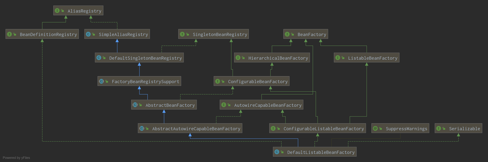

# SpringContext源码(2)-refresh方法

AbstractApplicationContext类作为所有Context的共同父类，定义了refresh()方法，代码如下：

```java
    /**
     * Load or refresh the persistent representation of the configuration,
     * which might an XML file, properties file, or relational database schema.
     * <p>As this is a startup method, it should destroy already created singletons
     * if it fails, to avoid dangling resources. In other words, after invocation
     * of that method, either all or no singletons at all should be instantiated.
     * @throws BeansException if the bean factory could not be initialized
     * @throws IllegalStateException if already initialized and multiple refresh
     * attempts are not supported
     */
    @Override
    public void refresh() throws BeansException, IllegalStateException {
        synchronized (this.startupShutdownMonitor) {
            // Prepare this context for refreshing.
            prepareRefresh();

            // Tell the subclass to refresh the internal bean factory.
            ConfigurableListableBeanFactory beanFactory = obtainFreshBeanFactory();

            // Prepare the bean factory for use in this context.
            prepareBeanFactory(beanFactory);

            try {
                // Allows post-processing of the bean factory in context subclasses.
                postProcessBeanFactory(beanFactory);

                // Invoke factory processors registered as beans in the context.
                invokeBeanFactoryPostProcessors(beanFactory);

                // Register bean processors that intercept bean creation.
                registerBeanPostProcessors(beanFactory);

                // Initialize message source for this context.
                initMessageSource();

                // Initialize event multicaster for this context.
                initApplicationEventMulticaster();

                // Initialize other special beans in specific context subclasses.
                onRefresh();

                // Check for listener beans and register them.
                registerListeners();

                // Instantiate all remaining (non-lazy-init) singletons.
                finishBeanFactoryInitialization(beanFactory);

                // Last step: publish corresponding event.
                finishRefresh();
            }

            catch (BeansException ex) {
                if (logger.isWarnEnabled()) {
                    logger.warn("Exception encountered during context initialization - " +
                            "cancelling refresh attempt: " + ex);
                }

                // Destroy already created singletons to avoid dangling resources.
                destroyBeans();

                // Reset 'active' flag.
                cancelRefresh(ex);

                // Propagate exception to caller.
                throw ex;
            }

            finally {
                // Reset common introspection caches in Spring's core, since we
                // might not ever need metadata for singleton beans anymore...
                resetCommonCaches();
            }
        }
    }
```

整个过程分下面的几个步骤：

1. 准备操作
    1. ```prepareRefresh();```
    2. 重新加载所有的bean定义到新的beanFactory：```ConfigurableListableBeanFactory beanFactory = obtainFreshBeanFactory();```
    3. 准备beanPostProcessor,Environment等:```prepareBeanFactory(beanFactory);```
2. PostProcessBeanFactory
    1. 执行Context子类的```postProcessBeanFactory(beanFactory)```方法
    2. 初始化并调用所有BeanFactoryPostProcessor类型的Bean的对应方法
3. 注册BeanPostProcessors：```registerBeanPostProcessors(beanFactory);```
4. 初始化非懒加载的Bean
    1. MessageSource
    2. ApplicationEventMulticaster
    3. onRefresh()
    4. ApplicationListener
    5. 所有非```@Lazy```的单例bean
5. 结束并清理缓存

## 1. 准备操作

1. ```prepareRefresh()```方法的执行过程如方法名所示，主要进行环境变量的操作、日志的打印以及某些listener的处理，主要过程如下：
    1. 更改当前Context的状态，```startupDate=当前时间;closed=false;active=true;```
    2. 打印debug记录
    3. 初始化上下文中的propertySources占位，在refresh之前已经完成
    4. 初始化earlyApplicationListeners和applicationListeners，当前用例里为空，注意存储使用的是LinkedHashSet，是有序set
    5. 初始化earlyApplicationEvents为空的LinkedHashSet
2. 加载Bean定义
3. 初始化BeanPostProcessor

### 1.1 重新加载新的beanFactory

```java
protected ConfigurableListableBeanFactory obtainFreshBeanFactory() {
    refreshBeanFactory();
    return getBeanFactory();
}
```

方法中主要是调用了方法refreshBeanFactory()，然后返回getBeanFactory()的执行结果，这两个方法在AbstractApplicationContext中均为抽象方法，对于本例来说，实际由子类
AbstractRefreshableApplicationContext实现

#### 1.1.1 refreshBeanFactory()

```java
    /**
     * This implementation performs an actual refresh of this context's underlying
     * bean factory, shutting down the previous bean factory (if any) and
     * initializing a fresh bean factory for the next phase of the context's lifecycle.
     */
    @Override
    protected final void refreshBeanFactory() throws BeansException {
        if (hasBeanFactory()) {
            destroyBeans();
            closeBeanFactory();
        }
        try {
            DefaultListableBeanFactory beanFactory = createBeanFactory();
            beanFactory.setSerializationId(getId());
            customizeBeanFactory(beanFactory);
            loadBeanDefinitions(beanFactory);
            synchronized (this.beanFactoryMonitor) {
                this.beanFactory = beanFactory;
            }
        }
        catch (IOException ex) {
            throw new ApplicationContextException("I/O error parsing bean definition source for " + getDisplayName(), ex);
        }
    }
```

执行过程分析：

1. 销毁当前所有已经创建的bean，关闭beanFactory
2. 创建一个新的beanFactory并赋值新序列号
3. 自定义beanFactory
4. 加载bean定义
5. 赋值给当前ApplicationContext的beanFactory

主要关注点应该在第2、3、4步中：

#### 1.1.2 初始化BeanFactory

```java
    protected DefaultListableBeanFactory createBeanFactory() {
        return new DefaultListableBeanFactory(getInternalParentBeanFactory());
    }
```

注意到初始化的BeanFactory类型为DefaultListableBeanFactory，且此处调用的是带参构造方法，参数类型为BeanFactory，这个参数后续会被设置为新BeanFactory的```parentBeanFactory```



1. 无参构造方法:

    ```java
        public AbstractAutowireCapableBeanFactory() {
            super();
            ignoreDependencyInterface(BeanNameAware.class);
            ignoreDependencyInterface(BeanFactoryAware.class);
            ignoreDependencyInterface(BeanClassLoaderAware.class);
        }
    ```

2. 初始化过程的缓存
    1. 存储各种bean的缓存：
        - BeanName => Bean实例: ```Map<String, Object> singletonObjects```,这个缓存会被并发访问且可预期的Size比较大，因此使用ConcurrentHashMap保证线程安全的同时，初始容量设置为256来减少初期的Map扩容
        - BeanName => ObjectFactory: ```Map<String, ObjectFactory<?>> singletonFactories```
        - 已注册的单例Bean名: ```Set<String> registeredSingletons```
        - BeanName => disposable instance: ```Map<String, Object> disposableBeans```
        - 正在创建的BeanName集合: ```NamedThreadLocal<String> currentlyCreatedBean```
        - FactoryBean缓存: ```ConcurrentMap<String, BeanWrapper> factoryBeanInstanceCache```
        - 工厂类 => 工厂方法: ```ConcurrentMap<Class<?>, Method[]> factoryMethodCandidateCache```
        - 不处理的类和接口: ```Set<Class<?>> ignoredDependencyTypes```和```Set<Class<?>> ignoredDependencyInterfaces```，后者默认放入被放入了BeanNameAware、BeanFactoryAware、BeanClassLoaderAware三个接口
        - 依赖Class到实例: ```Map<Class<?>, Object> resolvableDependencies```
        - bean名到bean定义: ```Map<String, BeanDefinition> beanDefinitionMap```:
        - 依赖class到bean名的数组，不管bean是否单例:```Map<Class<?>, String[]> allBeanNamesByType```
        - 依赖class到bean名的数组，bean是单例:```Map<Class<?>, String[]> singletonBeanNamesByType```
        - 按register顺序存储的beanDefinitionNames:```private volatile List<String> beanDefinitionNames```
        - 按register顺序存储的手动注册的单例:```private volatile Set<String> manualSingletonNames```

    2. BeanName之间映关系:

        - BeanName => 包含的BeanName集合: ```Map<String, Set<String>> containedBeanMap```
        - BeanName => 依赖BeanName集合: ```Map<String, Set<String>> dependentBeanMap```
        - BeanName => 处理中的依赖BeanName集合: ```private final Map<String, Set<String>> dependenciesForBeanMap = new ConcurrentHashMap<>(64);```

    3. 工具类和状态值
        - ClassLoader：
        - beanMetaData的flag：是否缓存metaData，默认true
        - propertyEditorRegistrars：PropertyEditorRegistrar集合
        - 自定义的PeropertyEditors集合:```Map<Class<?>, Class<? extends PropertyEditor>> customEditors```，
        - String处理，比如注解内部的String处理为数组:```List<StringValueResolver> embeddedValueResolvers```
        - ```List<BeanPostProcessor> beanPostProcessors```
        - 初始化策略:```private InstantiationStrategy instantiationStrategy = new CglibSubclassingInstantiationStrategy();```
        - 变量查询策略:```private ParameterNameDiscoverer parameterNameDiscoverer```
        - 自动注入处理:``````private AutowireCandidateResolver autowireCandidateResolver```

    4. Bean缓存变量和过程变量

        - ScopeName => Scope实例:```Map<String, Scope> scopes```
        - BeanName => 最终的BD:```Map<String, RootBeanDefinition> mergedBeanDefinitions```
        - 已经创建的Bean实例:```Set<String> alreadyCreated```
        - 正在Creating过程中的Bean:```ThreadLocal<Object> prototypesCurrentlyInCreation```

在初始化完成上述变量后

1. this.parentBeanFactory=parentBeanFactory
2. beanFactory被赋值序列号：类名@hashcode

#### 1.1.3 customizeBeanFactory(beanFactory)

更新beanFactory的```allowBeanDefinitionOverriding```和```allowCircularReferences```属性

### 1.2 加载Bean定义

将所有的bean定义加载到内部的beanFactory，ClassPathXmlApplicationContext的父类AbstractXmlApplicationContext复写了这个方法：

```java
@Override
protected void loadBeanDefinitions(DefaultListableBeanFactory beanFactory) throws BeansException, IOException {
    // Create a new XmlBeanDefinitionReader for the given BeanFactory.
    XmlBeanDefinitionReader beanDefinitionReader = new XmlBeanDefinitionReader(beanFactory);

    // Configure the bean definition reader with this context's
    // resource loading environment.
    beanDefinitionReader.setEnvironment(this.getEnvironment());
    beanDefinitionReader.setResourceLoader(this);
    beanDefinitionReader.setEntityResolver(new ResourceEntityResolver(this));

    // Allow a subclass to provide custom initialization of the reader,
    // then proceed with actually loading the bean definitions.
    initBeanDefinitionReader(beanDefinitionReader);
    loadBeanDefinitions(beanDefinitionReader);
}
```

1. XmlBeanDefinitionReader的初始化，传入当前的environment,resourceLoader和entityResolver变量
2. 调用子类initBeanDefinitionReader(beanDefinitionReader)方法
3. XmlBeanDefinitionReader加载Bean定义，先加载已经解析的Resource内部定义，再加载ConfigLocation内部定义，具体过程参见[XML配置加载BeanDefinition](./SpringContext_2_load_bd.md)

```java
protected void loadBeanDefinitions(XmlBeanDefinitionReader reader) throws BeansException, IOException {
    Resource[] configResources = getConfigResources();
    if (configResources != null) {
        reader.loadBeanDefinitions(configResources);
    }
    String[] configLocations = getConfigLocations();
    if (configLocations != null) {
        reader.loadBeanDefinitions(configLocations);
    }
}
```

### 1.3 预热BeanFactory

在这一步之前，所有的beanDefinition已经被读取并存入beanFactory中，这一步在bean初始化之前，准备一些环境相关的bean：

```java
    protected void prepareBeanFactory(ConfigurableListableBeanFactory beanFactory) {
        // Tell the internal bean factory to use the context's class loader etc.
        beanFactory.setBeanClassLoader(getClassLoader());
        beanFactory.setBeanExpressionResolver(new StandardBeanExpressionResolver(beanFactory.getBeanClassLoader()));
        beanFactory.addPropertyEditorRegistrar(new ResourceEditorRegistrar(this, getEnvironment()));

        // Configure the bean factory with context callbacks.
        beanFactory.addBeanPostProcessor(new ApplicationContextAwareProcessor(this));
        beanFactory.ignoreDependencyInterface(EnvironmentAware.class);
        beanFactory.ignoreDependencyInterface(EmbeddedValueResolverAware.class);
        beanFactory.ignoreDependencyInterface(ResourceLoaderAware.class);
        beanFactory.ignoreDependencyInterface(ApplicationEventPublisherAware.class);
        beanFactory.ignoreDependencyInterface(MessageSourceAware.class);
        beanFactory.ignoreDependencyInterface(ApplicationContextAware.class);

        // BeanFactory interface not registered as resolvable type in a plain factory.
        // MessageSource registered (and found for autowiring) as a bean.
        beanFactory.registerResolvableDependency(BeanFactory.class, beanFactory);
        beanFactory.registerResolvableDependency(ResourceLoader.class, this);
        beanFactory.registerResolvableDependency(ApplicationEventPublisher.class, this);
        beanFactory.registerResolvableDependency(ApplicationContext.class, this);

        // Register early post-processor for detecting inner beans as ApplicationListeners.
        beanFactory.addBeanPostProcessor(new ApplicationListenerDetector(this));

        // Detect a LoadTimeWeaver and prepare for weaving, if found.
        if (beanFactory.containsBean(LOAD_TIME_WEAVER_BEAN_NAME)) {
            beanFactory.addBeanPostProcessor(new LoadTimeWeaverAwareProcessor(beanFactory));
            // Set a temporary ClassLoader for type matching.
            beanFactory.setTempClassLoader(new ContextTypeMatchClassLoader(beanFactory.getBeanClassLoader()));
        }

        // Register default environment beans.
        if (!beanFactory.containsLocalBean(ENVIRONMENT_BEAN_NAME)) {
            beanFactory.registerSingleton(ENVIRONMENT_BEAN_NAME, getEnvironment());
        }
        if (!beanFactory.containsLocalBean(SYSTEM_PROPERTIES_BEAN_NAME)) {
            beanFactory.registerSingleton(SYSTEM_PROPERTIES_BEAN_NAME, getEnvironment().getSystemProperties());
        }
        if (!beanFactory.containsLocalBean(SYSTEM_ENVIRONMENT_BEAN_NAME)) {
            beanFactory.registerSingleton(SYSTEM_ENVIRONMENT_BEAN_NAME, getEnvironment().getSystemEnvironment());
        }
    }
```

1. 设置BeanClassLoader：与当前ApplicationContext相同
2. 设置BeanExpressionResolver：一个StandardBeanExpressionResolver实例
3. 新增PropertyEditorRegistrar
4. 新增BeanPostProcessor：ApplicationContextAwareProcessor
5. 忽略各种Aware：EnvironmentAware，EmbeddedValueResolverAware，ResourceLoaderAware，ApplicationEventPublisherAware，MessageSourceAware，ApplicationContextAware
6. 把beanFactory本身注册为ResolvableDependency，类型为BeanFactory
7. 把ApplicationContext本身注册为ResolvableDependency，类型是ResourceLoader，ApplicationEventPublisher，ApplicationContext
8. 新增BeanPostProcessor：ApplicationListenerDetector
9. 如果有定义LoadTimeWeaver，则新增BeanPostProcessor：LoadTimeWeaverAwareProcessor，并初始化临时ClassLoader:new ContextTypeMatchClassLoader
10. 将上下文内部的Environment注册为名叫"environment"的单例bean
11. 将上下文内部的Environment内部的SystemProperties注册为名叫"systemProperties"的单例bean
12. 将上下文内部的Environment内部的SystemEnvironment注册为名叫"systemEnvironment"的单例bean

在这里初始化并添加了两个BeanPostProcessor类型的对象:

- ApplicationContextAwareProcessor：这个类对Aware接口的bean有效，在bean实例初始化之前把ApplicationContext中的属性注入到bean中
- ApplicationListenerDetector：这个BeanPostProcessor对ApplicationListener接口的bean有效，在Bean初始化结束后，```this.applicationContext.addApplicationListener((ApplicationListener<?>) bean);```，值得一提的是，这个类覆写了.equals方法为```return (this == other || (other instanceof ApplicationListenerDetector && this.applicationContext == ((ApplicationListenerDetector) other).applicationContext))```，这样只要内部存有相同的applicationContext，则必定equals返回true，这样做的目的是保证在applicationContext存储BeanProcessor的map中，只有一个实例（ApplicationContext内部使用CopyOnWriteList存储BeanPostProcessor，而其remove时根据==和.equals()方法来判断对象是否存在）

## 2. postProcessBeanFactory

1. 执行子类的postProcessBeanFactory(beanFactory)方法，在AbstractApplicationContext里为空方法体
2. 初始化所有BeanFactoryPostProcessor类型的bean并调用对应接口方法，完成后处理 "loadTimeWeaver"

## 3. 注册BeanPostProcessors

1. 新增BeanPostProcessorChecker
2. 注册实现了```PriorityOrdered```接口的BeanPostProcessor
3. 注册实现了```Ordered```接口的BeanPostProcessor
4. 注册其余的BeanPostProcessor
5. 注册实现了MergedBeanDefinitionPostProcessor接口的BeanPostProcessor，注意，在往AbstractBeanFactory注册BeanPostProcessor时，会先remove再add以保证新注册的在List里排在后面
6. 新建一个ApplicationListenerDetector，添加到BeanPostProcessor最后（由于其复写了.equals()方法因此仍旧会移除原有的所有内部applicationContext相同的实例）

## 4. 初始化非懒加载的Bean

1. MessageSource
    > beanName为"messageSource"的Bean，或DelegatingMessageSource实例
2. ApplicationEventMulticaster
    > beanName为"applicationEventMulticaster"的Bean，或的bean，则使用，否则使用SimpleApplicationEventMulticaster实例

3. 调用子类的onRefresh()方法
4. ApplicationListener
    >如果有ApplicationListener或者bean，将其注册到applicationEventMulticaster上，并且广播当前已经缓存的earlyEventsToProcess事件

5. 非懒加载的单例bean

    在beanFactory中的bean定义、环境bean、listener、processor全部准备好后，开始初始化其他还未初始化的单例bean，具体实现在AbstractApplicationContext的finishBeanFactoryInitialization方法：

    ```java
        protected void finishBeanFactoryInitialization(ConfigurableListableBeanFactory beanFactory) {
            // Initialize conversion service for this context.
            if (beanFactory.containsBean(CONVERSION_SERVICE_BEAN_NAME) &&
                    beanFactory.isTypeMatch(CONVERSION_SERVICE_BEAN_NAME, ConversionService.class)) {
                beanFactory.setConversionService(
                        beanFactory.getBean(CONVERSION_SERVICE_BEAN_NAME, ConversionService.class));
            }

            // Register a default embedded value resolver if no bean post-processor
            // (such as a PropertyPlaceholderConfigurer bean) registered any before:
            // at this point, primarily for resolution in annotation attribute values.
            if (!beanFactory.hasEmbeddedValueResolver()) {
                beanFactory.addEmbeddedValueResolver(strVal -> getEnvironment().resolvePlaceholders(strVal));
            }

            // Initialize LoadTimeWeaverAware beans early to allow for registering their transformers early.
            String[] weaverAwareNames = beanFactory.getBeanNamesForType(LoadTimeWeaverAware.class, false, false);
            for (String weaverAwareName : weaverAwareNames) {
                getBean(weaverAwareName);
            }

            // Stop using the temporary ClassLoader for type matching.
            beanFactory.setTempClassLoader(null);

            // Allow for caching all bean definition metadata, not expecting further changes.
            beanFactory.freezeConfiguration();

            // Instantiate all remaining (non-lazy-init) singletons.
            beanFactory.preInstantiateSingletons();
        }
    ```

    1. 加载自定义的"conversionService"
    2. 初始化beanFactory的ValueResolver：strVal -> getEnvironment().resolvePlaceholders(strVal)
    3. 初始化LoadTimeWeaverAware，结束后清空临时ClassLoader
    4. 冻结当前的定义状态，准备初始化及提取MetaData
    5. 初始化自定义的单例Bean：preInstantiateSingletons()

## 5. 结束refresh()

```java
    protected void finishRefresh() {
        // Clear context-level resource caches (such as ASM metadata from scanning).
        clearResourceCaches();

        // Initialize lifecycle processor for this context.
        initLifecycleProcessor();

        // Propagate refresh to lifecycle processor first.
        getLifecycleProcessor().onRefresh();

        // Publish the final event.
        publishEvent(new ContextRefreshedEvent(this));

        // Participate in LiveBeansView MBean, if active.
        LiveBeansView.registerApplicationContext(this);
    }
```

1. 清空当前上下文的resourceCaches
2. 初始化LifecycleProcessor：
    > 名称为"lifecycleProcessor"的Bean或者DefaultLifecycleProcessor类型的单例Bean，将之赋值给this.lifecycleProcessor属性
3. 调用this.lifecycleProcessor的onRefresh()方法:
    1. 寻找所有Lifecycle类的Bean
    2. 遍历上面的Bean，组装成phases，放入一个LifecycleGroup
    3. 按顺序调用LifecircleGroup的start方法
    4. 标记当前LifecycleProcessor的running为true
4. 发布ContextRefreshedEvent：ApplicationEventMulticaster实例广播事件
5. 向MBeanServer注册MBean

## 6. 清理缓存

主要是清空一些静态类的缓存：

```java
    protected void resetCommonCaches() {
        ReflectionUtils.clearCache();
        AnnotationUtils.clearCache();
        ResolvableType.clearCache();
        CachedIntrospectionResults.clearClassLoader(getClassLoader());
    }
```

至此，ClassPathXmlApplicationContext的构造方法中的refresh()过程完成
