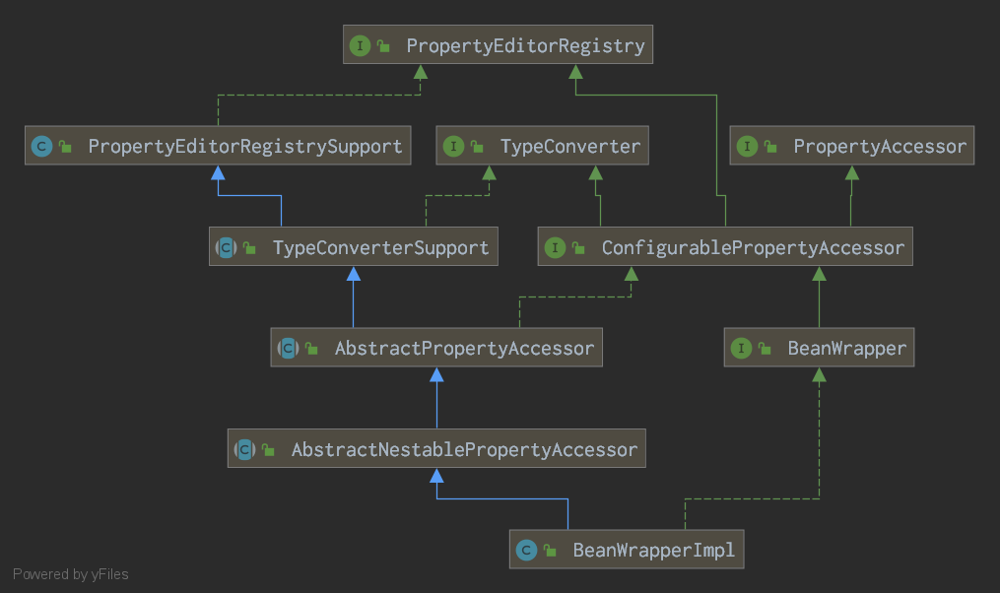

# SpringContext(6)-CreateBean

实际执行具体的bean创建的，是refresh过程新建的DefaultListableBeanFactory的父类AbstractAutowireCapableBeanFactory中的createBean方法：

```java
    @Override
    protected Object createBean(String beanName, RootBeanDefinition mbd, @Nullable Object[] args)
            throws BeanCreationException {

        if (logger.isTraceEnabled()) {
            logger.trace("Creating instance of bean '" + beanName + "'");
        }
        RootBeanDefinition mbdToUse = mbd;

        // Make sure bean class is actually resolved at this point, and
        // clone the bean definition in case of a dynamically resolved Class
        // which cannot be stored in the shared merged bean definition.
        Class<?> resolvedClass = resolveBeanClass(mbd, beanName);
        if (resolvedClass != null && !mbd.hasBeanClass() && mbd.getBeanClassName() != null) {
            mbdToUse = new RootBeanDefinition(mbd);
            mbdToUse.setBeanClass(resolvedClass);
        }

        // Prepare method overrides.
        try {
            mbdToUse.prepareMethodOverrides();
        }
        catch (BeanDefinitionValidationException ex) {
            throw new BeanDefinitionStoreException(mbdToUse.getResourceDescription(),
                    beanName, "Validation of method overrides failed", ex);
        }

        try {
            // Give BeanPostProcessors a chance to return a proxy instead of the target bean instance.
            Object bean = resolveBeforeInstantiation(beanName, mbdToUse);
            if (bean != null) {
                return bean;
            }
        }
        catch (Throwable ex) {
            throw new BeanCreationException(mbdToUse.getResourceDescription(), beanName,
                    "BeanPostProcessor before instantiation of bean failed", ex);
        }

        try {
            Object beanInstance = doCreateBean(beanName, mbdToUse, args);
            if (logger.isTraceEnabled()) {
                logger.trace("Finished creating instance of bean '" + beanName + "'");
            }
            return beanInstance;
        }
        catch (BeanCreationException | ImplicitlyAppearedSingletonException ex) {
            // A previously detected exception with proper bean creation context already,
            // or illegal singleton state to be communicated up to DefaultSingletonBeanRegistry.
            throw ex;
        }
        catch (Throwable ex) {
            throw new BeanCreationException(
                    mbdToUse.getResourceDescription(), beanName, "Unexpected exception during bean creation", ex);
        }
    }
```

1. 解析Bean对应的BeanClass
2. 如果bean内部还没有BeanClass属性，则拷贝一份bd(beanDefinition的简称，下同)，并传入上一步解析的BeanClass
3. 校验并准备所有的MethodOverride
4. 初始化之前的钩子函数：调用可能的InstantiationAwareBeanPostProcessor，这些BeanPostProcessor可能用来生成代理类，如果这些BeanPostProcessor中生成了bean，则返回生成的bean不进行后续操作
5. 调用doCreateBean方法来获取Bean实例
6. 调用

## 1.1 解析Bean对应的BeanClass

BeanClass的确定按找下述顺序确定

1. bd里的beanClass是Class对象（刚读取xml配置后是String对象）时，则返回bd的beanClass属性
2. 根据当前是否配置SecurityManager，来进行授权调用或非授权调用，调用的方法为doResolveBeanClass方法

### 1.1.1 doResolveBeanClass

1. 获取当前BeanFactory的BeanClassLoader属性
2. 判断是否需要调用动态类加载器，如果是则调用DecoratingClassLoaderexcludeClass(typeToMatch.getName())的方法
3. 如果不需要动态类加载器，则调用evaluateBeanDefinitionString(className,bd)方法来获取类名最终的字符串，注意从版本4.2开始，类名定义中允许添加#{}占位符定义，此步骤主要就是进行#{}占位符的解析
    1. 调用BeanFactory的内部维护的scope表，在表中获取bd相关的scope对应的Scope对象，
    2. 调用```this.beanExpressionResolver.evaluate(value, new BeanExpressionContext(this, scope))```来获取最终的class字符串
4. 判断上一步解析出的class字符串是否有变化，如果有变化，说明定义中有动态解析的部分，再判断是否已经解析出Class对象，解析出的话返回，
5. 如果没有解析出，则尝试用BeanFactory的TempClassLoader来加载Class对象，加载成功则返回，否则继续尝试
6. 如果上面全部未解析出，则调用BeanDefinition的```resolveBeanClass(Classloader classloader)```方法，此方法内部调用org.springframework.util包下的ClassUtils的forName(String,Classloader)方法，步骤如下：
    1. 比对工具类维护的primitiveTypeNameMap中存储的primitiveClass的Map，判断是否primitive类型，是则返回对应Class对象
    2. 比对工具内维护的commonClassCache缓存中存储的常用类，有则返回对应Class对象
    3. "java.lang.String[\]"类型的数组，则去掉后面的"[]"后缀后，递归调用forName方法获取Class，再根据Class类型返回对应的数组实例
    4. "[Ljava.lang.String;"类型定义的数组，则去掉"[L"前缀，递归调用forName方法获取Class，再根据Class类型返回对应的数组实例
    5. "[[I" or "[[Ljava.lang.String;"类型定义的数组，去掉"["前缀后，递归调用forName方法获取Class，再根据Class类型返回对应的数组实例
    6. 如果上面都不符合，则调用传入的ClassLoader(为空则获取defaultClassLoader)来加载类```Class.forName(name, false, clToUse)```并返回Class，如果还是没有加载，则尝试把最后一个"."替换为"$"继续调用Class.forName方法来加载内部类，如果还是不行，则抛异常

#### 1.1.1.1 beanExpressionResolver的evaluate方法

```java
    @Override
    @Nullable
    public Object evaluate(@Nullable String value, BeanExpressionContext evalContext) throws BeansException {
        if (!StringUtils.hasLength(value)) {
            return value;
        }
        try {
            Expression expr = this.expressionCache.get(value);
            if (expr == null) {
                expr = this.expressionParser.parseExpression(value, this.beanExpressionParserContext);
                this.expressionCache.put(value, expr);
            }
            StandardEvaluationContext sec = this.evaluationCache.get(evalContext);
            if (sec == null) {
                sec = new StandardEvaluationContext(evalContext);
                sec.addPropertyAccessor(new BeanExpressionContextAccessor());
                sec.addPropertyAccessor(new BeanFactoryAccessor());
                sec.addPropertyAccessor(new MapAccessor());
                sec.addPropertyAccessor(new EnvironmentAccessor());
                sec.setBeanResolver(new BeanFactoryResolver(evalContext.getBeanFactory()));
                sec.setTypeLocator(new StandardTypeLocator(evalContext.getBeanFactory().getBeanClassLoader()));
                ConversionService conversionService = evalContext.getBeanFactory().getConversionService();
                if (conversionService != null) {
                    sec.setTypeConverter(new StandardTypeConverter(conversionService));
                }
                customizeEvaluationContext(sec);
                this.evaluationCache.put(evalContext, sec);
            }
            return expr.getValue(sec);
        }
        catch (Throwable ex) {
            throw new BeanExpressionException("Expression parsing failed", ex);
        }
    }
```

1. 校验class名字符串，为空返回
2. 获取表达式对象：从内部维护的expressionCache中查找，如果没有，则调用内部的expressionParser来parse，将结果存入expressionCache中
3. 获取StandardEvaluationContext对象：从内部维护的evaluationCache中查找，如果没有则初始化一个：
    1. 新建StandardEvaluationContext对象实例
    2. 按顺序增加4个PropertyAccessor实[BeanExpressionContextAccessor\BeanFactoryAccessor\MapAccessor\EnvironmentAccessor],PropertyAccessor决定了如何从目标对象中读取或者写入Property，内部的getSpecificTargetClasses()、canRead()和canWrite()方法决定了适用的类和读写控制
    3. 增加一个BeanResolver:new BeanFactoryResolver(evalContext.getBeanFactory())
    4. 增加TypeLocator:new StandardTypeLocator(evalContext.getBeanFactory().getBeanClassLoader()),TypeLocator接口负责根据类型名（可能是全限定名也可能是String这种名称）获取Class对象， StandardTypeLocator会尝试在传入的ClassLoader中试图加载Class没有的话，就在"java.lang"下查找Class对象
    5. TypeConverter设置为new StandardTypeConverter(beanFactory.conversionService)

##### 1.1.1.1.1 获取表达式对象：expressionParser的parse方法

```java
    @Override
    public Expression parseExpression(String expressionString, @Nullable ParserContext context) throws ParseException {
        if (context != null && context.isTemplate()) {
            return parseTemplate(expressionString, context);
        }
        else {
            return doParseExpression(expressionString, context);
        }
    }
```

如果是模板表达式则调用parseTemplate方法，否则调用doParseExpression对象，后者返回SpelExpression对象，前者调用parseExpression方法，并根据返回的数组数量决定是直接返回数组的唯一元素或者将Expression数组包裹到CompositeStringExpression对象返回

```java
private Expression[] parseExpressions(String expressionString, ParserContext context)
```

将字符串转化为Expression数组，方法是如果字符串中有"#{expr}"格式的子串，则将之前面放入一个LiteralExpression对象，将字串解析后包裹在SpelExpression对象中，后面继续解析，最后将字符串分成多个Express对象，放到数组中返回。如果把LiteralExpression简写为LE,SpelExpression简写为SE，则"a#{b}c#{d}"会被parse为{LE("a"),SE{"b"},LE("c"),SE("d")}

## 1.2 校验并准备所有的MethodOverride

## 1.3 调用可能的InstantiationAwareBeanPostProcessor

## 1.4 doCreateBean方法

1. 初始化BeanWrapper为null，从factoryBeanInstanceCache中获取已经缓存的未完全完成的FactoryBean对应的BeanWrapper,如果上一步未获取到BeanWrapper，则调用BeanFactory的createBeanInstance方法，选取合适的构造策略来构建BeanWrapper
2. 调用可能的MergedBeanDefinitionPostProcessor修改bd，修改完成后mbd.postProcessed = true
3. 如果允许循环引用，则提前缓存创建中的单例Bean
4. 解析BeanWrapper中的PropertyValue
5. 初始化实例：调用回调方法和BeanPostProcessors
6. 处理循环引用和earlySingletonExposure
7. 注册Bean的销毁方法：DisposableBean到BeanFactory
8. 返回Bean实例

### 1.4.1 createBeanInstance方法

根据bd，按下列顺序尝试获取实例

1. InstanceSupplier：bd内部的Supplier
2. FactoryMethod：调用FactoryBean的对应Method
3. 寻找使用的Constructor和autowireMode：
    1. 缓存中查找：resolvedConstructorOrFactoryMethod缓存了可能的解析完成的Constructor和Factory Method，constructorArgumentsResolved标识了构造器参数列表是否解析完成
    2. 如果上述缓存没有发现，则调用determineConstructorsFromBeanPostProcessors方法来获取BeanProcessor相关的Constructor数组
    3. 如果上面返回的构造器数组非空（表明有BeanPostProcessor定义），或者bd里的autowireMode为AUTOWIRE_CONSTRUCTOR，或者调用初始化bean的args列表非空，或者bd的constructor-args配置非空，均表明可能需要自动注入，则调用```autowireConstructor(beanName, mbd, ctors, args)```方法来自动注入并初始化
    4. 如果class只有一个空构造器，且配置里也没有方法constructor-args参数列表，则调用空构造器来初始化实例```instantiateBean(beanName, mbd)```

#### 1.4.1.1 自动注入构造器的初始化Bean:autowireConstructor

#### 1.4.1.2 空参数构造器初始化Bean:instantiateBean

```java
    protected BeanWrapper instantiateBean(final String beanName, final RootBeanDefinition mbd) {
        try {
            Object beanInstance;
            final BeanFactory parent = this;
            if (System.getSecurityManager() != null) {
                beanInstance = AccessController.doPrivileged((PrivilegedAction<Object>) () ->
                        getInstantiationStrategy().instantiate(mbd, beanName, parent),
                        getAccessControlContext());
            }
            else {
                beanInstance = getInstantiationStrategy().instantiate(mbd, beanName, parent);
            }
            BeanWrapper bw = new BeanWrapperImpl(beanInstance);
            initBeanWrapper(bw);
            return bw;
        }
        catch (Throwable ex) {
            throw new BeanCreationException(
                    mbd.getResourceDescription(), beanName, "Instantiation of bean failed", ex);
        }
    }
```

1. 调用InstantiationStrategy(对于AbstractAutoWireCapableBeanFactory是CglibSubclassingInstantiationStrategy)的instantiate(mbd, beanName, parent)方法来获取bean实例
2. 获取的实例包裹到BeanWrapperImpl对象中
3. initBeanWrapper：初始化BeanWrapper内部的editor和conversionService
4. 返回创建好的BeanWrapper

##### 1.4.1.2.1 CglibSubclassingInstantiationStrategy的instantiate方法

```java
    @Override
    public Object instantiate(RootBeanDefinition bd, @Nullable String beanName, BeanFactory owner) {
        // Don't override the class with CGLIB if no overrides.
        if (!bd.hasMethodOverrides()) {
            Constructor<?> constructorToUse;
            synchronized (bd.constructorArgumentLock) {
                constructorToUse = (Constructor<?>) bd.resolvedConstructorOrFactoryMethod;
                if (constructorToUse == null) {
                    final Class<?> clazz = bd.getBeanClass();
                    if (clazz.isInterface()) {
                        throw new BeanInstantiationException(clazz, "Specified class is an interface");
                    }
                    try {
                        if (System.getSecurityManager() != null) {
                            constructorToUse = AccessController.doPrivileged(
                                    (PrivilegedExceptionAction<Constructor<?>>) clazz::getDeclaredConstructor);
                        }
                        else {
                            constructorToUse = clazz.getDeclaredConstructor();
                        }
                        bd.resolvedConstructorOrFactoryMethod = constructorToUse;
                    }
                    catch (Throwable ex) {
                        throw new BeanInstantiationException(clazz, "No default constructor found", ex);
                    }
                }
            }
            return BeanUtils.instantiateClass(constructorToUse);
        }
        else {
            // Must generate CGLIB subclass.
            return instantiateWithMethodInjection(bd, beanName, owner);
        }
    }
```

如果没有MethodOverride的情况，则调用clazz.getDeclaredConstructor()方法获取空参数构造器，存入bd的resolvedConstructorOrFactoryMethod缓存后，调用BeanUtils.instantiateClass(constructorToUse)方法来获取实例，在这个方法中，会尝试将非public的Constructor更改为public，然后调用constructor.newInstance()方法来获取对象并返回，当然，如果是Kotlin，则调用Kotlin相关的代理方法来构造

如果有MethodOverride的情况，则调用cglib框架的Enhancer相关方法，创建bd里beanClass的子类，使用反射来调用子类的构造器并返回构造的bean实例

##### 1.4.1.2.2 获取的实例包裹到BeanWrapperImpl对象中，并initBeanWrapper

BeanWrapperImpl的类关系图如下：



##### 1.4.1.2.3 BeanFactory的initBeanWrapper方法

```java
    protected void initBeanWrapper(BeanWrapper bw) {
        bw.setConversionService(getConversionService());
        registerCustomEditors(bw);
    }
```

第一步是将BeanFactory的ConvertionService传入BeanWrapper，第二步是初始化BeanWrapper的自定义Editor:

```java
    protected void registerCustomEditors(PropertyEditorRegistry registry) {
        PropertyEditorRegistrySupport registrySupport =
                (registry instanceof PropertyEditorRegistrySupport ? (PropertyEditorRegistrySupport) registry : null);
        if (registrySupport != null) {
            registrySupport.useConfigValueEditors();
        }
        if (!this.propertyEditorRegistrars.isEmpty()) {
            for (PropertyEditorRegistrar registrar : this.propertyEditorRegistrars) {
                try {
                    registrar.registerCustomEditors(registry);
                }
                catch (BeanCreationException ex) {
                    Throwable rootCause = ex.getMostSpecificCause();
                    if (rootCause instanceof BeanCurrentlyInCreationException) {
                        BeanCreationException bce = (BeanCreationException) rootCause;
                        String bceBeanName = bce.getBeanName();
                        if (bceBeanName != null && isCurrentlyInCreation(bceBeanName)) {
                            if (logger.isDebugEnabled()) {
                                logger.debug("PropertyEditorRegistrar [" + registrar.getClass().getName() +
                                        "] failed because it tried to obtain currently created bean '" +
                                        ex.getBeanName() + "': " + ex.getMessage());
                            }
                            onSuppressedException(ex);
                            continue;
                        }
                    }
                    throw ex;
                }
            }
        }
        if (!this.customEditors.isEmpty()) {
            this.customEditors.forEach((requiredType, editorClass) ->
                    registry.registerCustomEditor(requiredType, BeanUtils.instantiateClass(editorClass)));
        }
    }
```

1. 将BeanWrapper的configValueEditorsActive设为true
2. 遍历BeanFactory内部的PropertyEditorRegistrars，对每个registar调用```registrar.registerCustomEditors(registry)```方法，默认的BeanFactory会有一个ResourceEditorRegistrar
3. 遍历BeanFactory内部的CustomPropertyEditors，对每个Editor调用BeanWrapper的```registerCustomEditor(requiredType, BeanUtils.instantiateClass(editorClass)))```方法

###### 1.4.1.2.3.1 ResourceEditorRegistrar的```registrar.registerCustomEditors(registry)```方法

```java
    @Override
    public void registerCustomEditors(PropertyEditorRegistry registry) {
        ResourceEditor baseEditor = new ResourceEditor(this.resourceLoader, this.propertyResolver);
        doRegisterEditor(registry, Resource.class, baseEditor);
        doRegisterEditor(registry, ContextResource.class, baseEditor);
        doRegisterEditor(registry, InputStream.class, new InputStreamEditor(baseEditor));
        doRegisterEditor(registry, InputSource.class, new InputSourceEditor(baseEditor));
        doRegisterEditor(registry, File.class, new FileEditor(baseEditor));
        doRegisterEditor(registry, Path.class, new PathEditor(baseEditor));
        doRegisterEditor(registry, Reader.class, new ReaderEditor(baseEditor));
        doRegisterEditor(registry, URL.class, new URLEditor(baseEditor));

        ClassLoader classLoader = this.resourceLoader.getClassLoader();
        doRegisterEditor(registry, URI.class, new URIEditor(classLoader));
        doRegisterEditor(registry, Class.class, new ClassEditor(classLoader));
        doRegisterEditor(registry, Class[].class, new ClassArrayEditor(classLoader));

        if (this.resourceLoader instanceof ResourcePatternResolver) {
            doRegisterEditor(registry, Resource[].class,
                    new ResourceArrayPropertyEditor((ResourcePatternResolver) this.resourceLoader, this.propertyResolver));
        }
    }

    /**
     * Override default editor, if possible (since that's what we really mean to do here);
     * otherwise register as a custom editor.
     */
    private void doRegisterEditor(PropertyEditorRegistry registry, Class<?> requiredType, PropertyEditor editor) {
        if (registry instanceof PropertyEditorRegistrySupport) {
            ((PropertyEditorRegistrySupport) registry).overrideDefaultEditor(requiredType, editor);
        }
        else {
            registry.registerCustomEditor(requiredType, editor);
        }
    }
```

代码简洁明了：

1. 根据当前BeanWrapper的resourceLoader和propertyResolver初始化一个ResourceEditor
2. 将上一步初始化的ResourceEditor放入BeanWrapper的overriddenDefaultEditors并管理Resource、ContextResource类型，**值得注意的是，在实际根据类型获取PropertyEditor时，overriddenDefaultEditors优先级高于defaultEditors，即前者覆盖后者**
3. 类似的将ResourceEditor装饰（装饰者模式）成InputStreamEditor并关联InputSteam类，等等
4. 根据当前的resourceLoader的ClassLoader，初始化URIEditor、ClassEditor、ClassArrayEditor并关联

###### 1.4.1.2.3.2 BeanWrapper的```registerCustomEditor(requiredType, BeanUtils.instantiateClass(editorClass)))```方法

### 1.4.2 MergedBeanDefinitionPostProcessor修改bd

在AbstractApplicationContext的refresh方法中，获取完新BeanFactory后```prepareBeanFactory(beanFactory)```的过程中，初始化了一个ApplicationListenerDetector类型的BeanPostProcessor，并在后续的```registerBeanPostProcessors(beanFactory);```过程中刷新了它，这个类实现了MergedBeanDefinitionPostProcessor接口，因此在会被调用到BeanPostProcessor的```postProcessMergedBeanDefinition(mbd, beanType, beanName)```方法:

```java
    @Override
    public void postProcessMergedBeanDefinition(RootBeanDefinition beanDefinition, Class<?> beanType, String beanName) {
        this.singletonNames.put(beanName, beanDefinition.isSingleton());
    }
```

这里内部维护的singletonNames存储了每个bean是否可以被注册成ApplicationListener的flag，初始化bean开始前，值为beanDefinition.isSingleton()，即认为所有的单例类都可注册为ApplicationListener

### 1.4.3 提前缓存创建中的单例Bean

1. 判断依据：```mbd.isSingleton() && this.allowCircularReferences && isSingletonCurrentlyInCreation(beanName)```
    1. bd是单例Bean
    2. BeanFactory允许循环引用(默认True)
    3. 单例正在创建中（所以才需要提前缓存）
2. 存入内部缓存并更新相关属性：```addSingletonFactory(beanName, () -> getEarlyBeanReference(beanName, mbd, bean));```

#### 1.4.3.1 将对应的SingletonFactory存入内部缓存并更新相关属性

调用到DefaultSingletonBeanRegistry类的方法：

```java
    protected void addSingletonFactory(String beanName, ObjectFactory<?> singletonFactory) {
        Assert.notNull(singletonFactory, "Singleton factory must not be null");
        synchronized (this.singletonObjects) {
            if (!this.singletonObjects.containsKey(beanName)) {
                this.singletonFactories.put(beanName, singletonFactory);
                this.earlySingletonObjects.remove(beanName);
                this.registeredSingletons.add(beanName);
            }
        }
    }
```

各个缓存作用为：

- singletonObjects：存储单例Bean，bean name to bean instance
- singletonFactories：存储生成单例Bean的ObjectFactory，bean name to ObjectFactory
- earlySingletonObjects：存储early阶段的Bean，bean name to bean instance
- registeredSingletons：LinkedHashSet类型，**按顺序**存储注册的单例Bean的名称

### 1.4.4 解析BeanWrapper中的PropertyValue并set到Bean：```populateBean(beanName, mbd, instanceWrapper);```

1. 校验bd
2. 如果!mbd.isSynthetic()且BeanFactory内部有InstantiationAwareBeanPostProcessor实例，则调用postProcessAfterInstantiation方法处理BeanWrapper内部的bean实例，如果此Processor要求执行完毕后返回，则直接返回，不进行下一步操作
3. 如果autowireMode不是AUTO，则根据bd内部的autowireMode调用响应的方法进行自动注入：
    1. AUTOWIRE_BY_NAME：```autowireByName(beanName, mbd, bw, newPvs)```
    2. AUTOWIRE_BY_TYPE：```autowireByType(beanName, mbd, bw, newPvs)```
4. 如果BeanFactory内部有InstantiationAwareBeanPostProcessor实例，则
    1. 调用BeanFactory的filterPropertyDescriptorsForDependencyCheck方法过滤PropertyValue，过滤掉ignoredDependencyTypes和ignoredDependencyInterfaces中定义的类型
    2. 调用InstantiationAwareBeanPostProcessor的postProcessProperties处理PropertyValue
5. 检查依赖的PropertyValue
6. 调用applyPropertyValues方法来解析并把PropertyValue解析到Bean

#### 1.4.4.1 按Name自动注入的PropertyValue处理：autowireByName方法

#### 1.4.4.2 按类型自动注入的PropertyValue处理：autowireByType方法

#### 1.4.4.3 applyPropertyValues方法

```java
    protected void applyPropertyValues(String beanName, BeanDefinition mbd, BeanWrapper bw, PropertyValues pvs) {
        if (pvs.isEmpty()) {
            return;
        }

        if (System.getSecurityManager() != null && bw instanceof BeanWrapperImpl) {
            ((BeanWrapperImpl) bw).setSecurityContext(getAccessControlContext());
        }

        MutablePropertyValues mpvs = null;
        List<PropertyValue> original;

        if (pvs instanceof MutablePropertyValues) {
            mpvs = (MutablePropertyValues) pvs;
            if (mpvs.isConverted()) {
                // Shortcut: use the pre-converted values as-is.
                try {
                    bw.setPropertyValues(mpvs);
                    return;
                }
                catch (BeansException ex) {
                    throw new BeanCreationException(
                            mbd.getResourceDescription(), beanName, "Error setting property values", ex);
                }
            }
            original = mpvs.getPropertyValueList();
        }
        else {
            original = Arrays.asList(pvs.getPropertyValues());
        }

        TypeConverter converter = getCustomTypeConverter();
        if (converter == null) {
            converter = bw;
        }
        BeanDefinitionValueResolver valueResolver = new BeanDefinitionValueResolver(this, beanName, mbd, converter);

        // Create a deep copy, resolving any references for values.
        List<PropertyValue> deepCopy = new ArrayList<>(original.size());
        boolean resolveNecessary = false;
        for (PropertyValue pv : original) {
            if (pv.isConverted()) {
                deepCopy.add(pv);
            }
            else {
                String propertyName = pv.getName();
                Object originalValue = pv.getValue();
                Object resolvedValue = valueResolver.resolveValueIfNecessary(pv, originalValue);
                Object convertedValue = resolvedValue;
                boolean convertible = bw.isWritableProperty(propertyName) &&
                        !PropertyAccessorUtils.isNestedOrIndexedProperty(propertyName);
                if (convertible) {
                    convertedValue = convertForProperty(resolvedValue, propertyName, bw, converter);
                }
                // Possibly store converted value in merged bean definition,
                // in order to avoid re-conversion for every created bean instance.
                if (resolvedValue == originalValue) {
                    if (convertible) {
                        pv.setConvertedValue(convertedValue);
                    }
                    deepCopy.add(pv);
                }
                else if (convertible && originalValue instanceof TypedStringValue &&
                        !((TypedStringValue) originalValue).isDynamic() &&
                        !(convertedValue instanceof Collection || ObjectUtils.isArray(convertedValue))) {
                    pv.setConvertedValue(convertedValue);
                    deepCopy.add(pv);
                }
                else {
                    resolveNecessary = true;
                    deepCopy.add(new PropertyValue(pv, convertedValue));
                }
            }
        }
        if (mpvs != null && !resolveNecessary) {
            mpvs.setConverted();
        }

        // Set our (possibly massaged) deep copy.
        try {
            bw.setPropertyValues(new MutablePropertyValues(deepCopy));
        }
        catch (BeansException ex) {
            throw new BeanCreationException(
                    mbd.getResourceDescription(), beanName, "Error setting property values", ex);
        }
    }
```

下面pvs表示传入的PropertyValues

1. 如果传入的pvs内部无PropertyValue，则不需要处理PropertyValue，直接返回
2. 判断pvs是否已经是MutablePropertyValues对象，如果是，进一步判断是否pvs已经Converted，是的话直接调用BeanWrapper的```setPropertyValues```方法后返回
3. 获取TypeConverter：读取BeanFactory内部的typeConverter属性，null的话用BeanWrapper
4. 初始化valueResolver：```new BeanDefinitionValueResolver(this, beanName, mbd, converter)```
5. 解析PropertyValue：
    1. 获取PropertyName
    2. 获取原PropertyValue
    3. 调用valueResolver的resolveValueIfNecessary来resolve原PropertyValue，该方法里根据传入的PropertyValue的类型来决定使用哪种策略，下面pv代表当前在resolve的PropertyValue：
        1. RuntimeBeanReference：根据pv的toParent属性来决定是否去父BeanFactory找，根据beanName来查找Bean，注册到BeanFactory的dependentBeanMap中
        2. RuntimeBeanNameReference：调用BeanFactory的evaluateBeanDefinitionString方法来处理Ref的BeanName，校验是否存在Bean，存在的话返回处理后的**ref内的beanName**
        3. BeanDefinitionHolder：resolveInnerBean
        4. BeanDefinition：resolveInnerBean
        5. ManagedArray：对于数组内的每个对象，确认返回的List的类型后，递归调用resolveValueIfNecessary方法来处理并放入新数组返回
        6. resolveManagedList：递归调用resolveValueIfNecessary方法来处理并放入新List返回，相比Array少了确认List的内部类型的步骤
        7. ManagedSet：递归调用resolveValueIfNecessary方法来处理并放入新Set返回
        8. ManagedMap：递归调用resolveValueIfNecessary方法来处理key和value并放入新Map返回
        9. ManagedProperties：迭代每个元素，调用beanExpressionResolver处理每个Property的key和value字符串，组装成新的Properties返回
        10. TypedStringValue：见[具体说明](#1.4.4.3.1)
    4. 判断pv是否可转换，需要property是可写属性，并且不是数组或者嵌套属性
        1. 判断propertyName是否可写：
            1. 获取PropertyHandler：
                1. 以"."为分割符切分propertyName，获取最后部分
                2. 根据上面的结果，在BeanWrapper里寻找缓存的CachedIntrospectionResults对象中对应的属性的PropertyDescriptor（具体缓存过程参考[获取CachedIntrospectionResults并缓存到BeanWrapper](XmlContext_7_CachedIntrospectionResults.md))，将之包装到BeanPropertyHandler中并返回，此ph中writable字段根据PropertyDescriptor对象是否有WriteMethod决定
            2. 判断此Property是否可写：上一步PropertyHandler非空的话返回其writable属性，如果为空的话，调用getPropertyValue判断是否为数组属性("a[0]")或者嵌套属性("p.name")，是的话尝试获取Value，如果成功说明可写
        2. 判断是不是数组或者嵌套属性：校验propertyName中是否有"["或者"."
    5. 如果上一步判断PropertyValue可转换，则调用convertForProperty方法来转换值
    6. 将上一步转换后的值，放入propertyValue的convertedValue属性中缓存起来，下次不需要重新转换（pv是从BeanDefinition中取出的）
6. 设置PropertyValues为converted状态
7. 将解析出的所有的PropertyValue包裹到一个新的MutablePropertyValues对象中，调用BeanWrapper对象的setPropertyValues方法，具体从MutablePropertyValues对象集成到Bean的过程参考[PropertyValue到Bean内部属性](XmlContext_10_PropertyValueSetToBean.md)

##### 1.4.4.3.1 TypedStringValue的处理

1. 调用BeanFactory的beanExpressionResolver处理字符串
2. 获取目标类型的Class对象：
    1. 获取value内部的targetType，此属性缓存了已经解析好的目标类型，如果已经是Class对象则返回，为空则下一步
    2. 如果value内部的targetType是String类型，则调用BeanFactory的ClassLoader加载类对象返回
    3. 如果targetType为null，则返回null
3. 如果上一步解析出了非空的目标类型，调用typeConverter.convertIfNecessary方法来转换并返回，否则直接返回第一步处理完成的字符串

##### 1.4.4.3.2 值的类型转换：BeanFactory的convertForProperty方法

先是AbstractAutowireCapableBeanFactory类

最终实际是通过调用BeanWrapperImpl中typeConverterDelegate的convertIfNecessary方法来转换出实际需要的propertyValue：

```java
    @Nullable
    public <T> T convertIfNecessary(@Nullable String propertyName, @Nullable Object oldValue, @Nullable Object newValue,
            @Nullable Class<T> requiredType, @Nullable TypeDescriptor typeDescriptor) throws IllegalArgumentException {

        // Custom editor for this type?
        PropertyEditor editor = this.propertyEditorRegistry.findCustomEditor(requiredType, propertyName);

        ConversionFailedException conversionAttemptEx = null;

        // No custom editor but custom ConversionService specified?
        ConversionService conversionService = this.propertyEditorRegistry.getConversionService();
        if (editor == null && conversionService != null && newValue != null && typeDescriptor != null) {
            TypeDescriptor sourceTypeDesc = TypeDescriptor.forObject(newValue);
            if (conversionService.canConvert(sourceTypeDesc, typeDescriptor)) {
                try {
                    return (T) conversionService.convert(newValue, sourceTypeDesc, typeDescriptor);
                }
                catch (ConversionFailedException ex) {
                    // fallback to default conversion logic below
                    conversionAttemptEx = ex;
                }
            }
        }

        Object convertedValue = newValue;

        // Value not of required type?
        if (editor != null || (requiredType != null && !ClassUtils.isAssignableValue(requiredType, convertedValue))) {
            if (typeDescriptor != null && requiredType != null && Collection.class.isAssignableFrom(requiredType) &&
                    convertedValue instanceof String) {
                TypeDescriptor elementTypeDesc = typeDescriptor.getElementTypeDescriptor();
                if (elementTypeDesc != null) {
                    Class<?> elementType = elementTypeDesc.getType();
                    if (Class.class == elementType || Enum.class.isAssignableFrom(elementType)) {
                        convertedValue = StringUtils.commaDelimitedListToStringArray((String) convertedValue);
                    }
                }
            }
            if (editor == null) {
                editor = findDefaultEditor(requiredType);
            }
            convertedValue = doConvertValue(oldValue, convertedValue, requiredType, editor);
        }

        boolean standardConversion = false;

        if (requiredType != null) {
            // Try to apply some standard type conversion rules if appropriate.

            if (convertedValue != null) {
                if (Object.class == requiredType) {
                    return (T) convertedValue;
                }
                else if (requiredType.isArray()) {
                    // Array required -> apply appropriate conversion of elements.
                    if (convertedValue instanceof String && Enum.class.isAssignableFrom(requiredType.getComponentType())) {
                        convertedValue = StringUtils.commaDelimitedListToStringArray((String) convertedValue);
                    }
                    return (T) convertToTypedArray(convertedValue, propertyName, requiredType.getComponentType());
                }
                else if (convertedValue instanceof Collection) {
                    // Convert elements to target type, if determined.
                    convertedValue = convertToTypedCollection(
                            (Collection<?>) convertedValue, propertyName, requiredType, typeDescriptor);
                    standardConversion = true;
                }
                else if (convertedValue instanceof Map) {
                    // Convert keys and values to respective target type, if determined.
                    convertedValue = convertToTypedMap(
                            (Map<?, ?>) convertedValue, propertyName, requiredType, typeDescriptor);
                    standardConversion = true;
                }
                if (convertedValue.getClass().isArray() && Array.getLength(convertedValue) == 1) {
                    convertedValue = Array.get(convertedValue, 0);
                    standardConversion = true;
                }
                if (String.class == requiredType && ClassUtils.isPrimitiveOrWrapper(convertedValue.getClass())) {
                    // We can stringify any primitive value...
                    return (T) convertedValue.toString();
                }
                else if (convertedValue instanceof String && !requiredType.isInstance(convertedValue)) {
                    if (conversionAttemptEx == null && !requiredType.isInterface() && !requiredType.isEnum()) {
                        try {
                            Constructor<T> strCtor = requiredType.getConstructor(String.class);
                            return BeanUtils.instantiateClass(strCtor, convertedValue);
                        }
                        catch (NoSuchMethodException ex) {
                            // proceed with field lookup
                            if (logger.isTraceEnabled()) {
                                logger.trace("No String constructor found on type [" + requiredType.getName() + "]", ex);
                            }
                        }
                        catch (Exception ex) {
                            if (logger.isDebugEnabled()) {
                                logger.debug("Construction via String failed for type [" + requiredType.getName() + "]", ex);
                            }
                        }
                    }
                    String trimmedValue = ((String) convertedValue).trim();
                    if (requiredType.isEnum() && trimmedValue.isEmpty()) {
                        // It's an empty enum identifier: reset the enum value to null.
                        return null;
                    }
                    convertedValue = attemptToConvertStringToEnum(requiredType, trimmedValue, convertedValue);
                    standardConversion = true;
                }
                else if (convertedValue instanceof Number && Number.class.isAssignableFrom(requiredType)) {
                    convertedValue = NumberUtils.convertNumberToTargetClass(
                            (Number) convertedValue, (Class<Number>) requiredType);
                    standardConversion = true;
                }
            }
            else {
                // convertedValue == null
                if (requiredType == Optional.class) {
                    convertedValue = Optional.empty();
                }
            }

            if (!ClassUtils.isAssignableValue(requiredType, convertedValue)) {
                if (conversionAttemptEx != null) {
                    // Original exception from former ConversionService call above...
                    throw conversionAttemptEx;
                }
                else if (conversionService != null && typeDescriptor != null) {
                    // ConversionService not tried before, probably custom editor found
                    // but editor couldn't produce the required type...
                    TypeDescriptor sourceTypeDesc = TypeDescriptor.forObject(newValue);
                    if (conversionService.canConvert(sourceTypeDesc, typeDescriptor)) {
                        return (T) conversionService.convert(newValue, sourceTypeDesc, typeDescriptor);
                    }
                }

                // Definitely doesn't match: throw IllegalArgumentException/IllegalStateException
                StringBuilder msg = new StringBuilder();
                msg.append("Cannot convert value of type '").append(ClassUtils.getDescriptiveType(newValue));
                msg.append("' to required type '").append(ClassUtils.getQualifiedName(requiredType)).append("'");
                if (propertyName != null) {
                    msg.append(" for property '").append(propertyName).append("'");
                }
                if (editor != null) {
                    msg.append(": PropertyEditor [").append(editor.getClass().getName()).append(
                            "] returned inappropriate value of type '").append(
                            ClassUtils.getDescriptiveType(convertedValue)).append("'");
                    throw new IllegalArgumentException(msg.toString());
                }
                else {
                    msg.append(": no matching editors or conversion strategy found");
                    throw new IllegalStateException(msg.toString());
                }
            }
        }

        if (conversionAttemptEx != null) {
            if (editor == null && !standardConversion && requiredType != null && Object.class != requiredType) {
                throw conversionAttemptEx;
            }
        }

        return (T) convertedValue;
    }
```

1. 获取customEditors中的PropertyEditor，内部执行时还会检查是否有当前需要的类的父类customEditors
2. 如果没有customEditor但是有conversionService，则调用conversionService的convert方法来处理并返回
3. 如果没有customEditor且现在的PropertyValue类型还是不是目标类型
    1. 如果目标类型是Collection类型而且当前的PropertyValue是字符串，判断目标数组内部元素类型是不是Class或者Enum类型，如果是，则先把字符串根据","分割成字符串数组
    2. 根据目标类型获取defaultEditor
    3. 调用BeanWrapperImpl的doConvertValue方法来Convert当前的PropertyValue
4. 一些特殊的转换过程：
    1. 目标类型是数组：
        1. 数组内部类型是Enum型，先把单个字符串解析成字符串数组
        2. 递归调用convertIfNecessary来转换当前数组（Collection）中的值到新数组，如果只有一个对象则转换成只有一个元素的数组
    2. 转换过的convertedValue是Collection元素：convertToTypedCollection方法
    3. 转换过的convertedValue是Map元素：convertToTypedMap方法
    4. 转换过的convertedValue是数组且只有一个元素：convertedValue = convertedValue[0]
5. 如果目标类型是String类且当前转换过的值是原生类型，返回convertedValue.toString()
6. 如果convertedValue是String但目标类型不是String型：
    1. 如果目标类型不是接口也不是Enum型，那么尝试调用目标Class的参数为一个String的构造方法，并将convertedValue传入
    2. 如果目标类型是Enumerate，那么调用attemptToConvertStringToEnum来尝试转换下convertedValue
7. 如果convertedValue是Number且目标类型也是Number的子类型，调用NumberUtils的方法来进行转换
8. 如果convertedValue == null 且 目标类型是Optional型，则convertedValue = Optional.empty();
9. 如果目标类型和当前的convertedValue = Optional.empty();
10. 如果convertedValue还是与目标类型不匹配，则调用convertionService最后转换一下并返回
11. 最后返回转换好的值，或者抛出异常

###### 1.4.3.2.1. BeanWrapperImpl的doConvertValue方法

```java
    @Nullable
    private Object doConvertValue(@Nullable Object oldValue, @Nullable Object newValue,
            @Nullable Class<?> requiredType, @Nullable PropertyEditor editor) {

        Object convertedValue = newValue;

        if (editor != null && !(convertedValue instanceof String)) {
            // Not a String -> use PropertyEditor's setValue.
            // With standard PropertyEditors, this will return the very same object;
            // we just want to allow special PropertyEditors to override setValue
            // for type conversion from non-String values to the required type.
            try {
                editor.setValue(convertedValue);
                Object newConvertedValue = editor.getValue();
                if (newConvertedValue != convertedValue) {
                    convertedValue = newConvertedValue;
                    // Reset PropertyEditor: It already did a proper conversion.
                    // Don't use it again for a setAsText call.
                    editor = null;
                }
            }
            catch (Exception ex) {
                // Swallow and proceed.
            }
        }

        Object returnValue = convertedValue;

        if (requiredType != null && !requiredType.isArray() && convertedValue instanceof String[]) {
            // Convert String array to a comma-separated String.
            // Only applies if no PropertyEditor converted the String array before.
            // The CSV String will be passed into a PropertyEditor's setAsText method, if any.
            convertedValue = StringUtils.arrayToCommaDelimitedString((String[]) convertedValue);
        }

        if (convertedValue instanceof String) {
            if (editor != null) {
                // Use PropertyEditor's setAsText in case of a String value.
                String newTextValue = (String) convertedValue;
                return doConvertTextValue(oldValue, newTextValue, editor);
            }
            else if (String.class == requiredType) {
                returnValue = convertedValue;
            }
        }

        return returnValue;
    }
```

1. 如果入参不是String类型，则调用editor的```setValue()```方法来转换，```java.beans.PropertyEditorSupport```类中的实现是```setValue()```方法不进行任何转换，而对于大部分```org.springframework.beans.propertyeditors```包下的子类，都是直接继承但没有复写其实现方法的，在这里调用是因为确实有部分PropertyEditor覆写了这个方法的罗技，比如CustomNumberEditor，会在入参是Number类型值的时候，尝试调用目标类型的相关静态方法来转换（```BigInteger.valueOf()```,```Double.valueOf```,```new BigDecimal(number.toString())```等)，这里还有一个小细节，如果确实发生了转换（返回值不等于原值），说明setValue()方法确实被覆写且发生了转换，则editor被置为null，不再调用setAsText()方法
2. 如果入参是String数组但目标不是数组类型，则先将入参数组合并为用","分割的单个字符串
3. 如果入参是String对象且editor不为空，则调用```doConvertTextValue(oldValue, newTextValue, editor)```方法转换并返回:
    1. 尝试调用editor的setValue(oldValue)
    2. 调用editor的setAsText(newTextValue)方法，对于CustomNumberEditor(即使叫这个名字，在BeanWrapperImpl中依然是defaultEditors的一员)，实际还是根据目标的类型，调用相关静态方法来转换（```Integer.decode(trimmed)```,```BigInteger.valueOf()```,```Double.valueOf```,```new BigDecimal(number.toString())```等)，值传入value属性中
4. 如果editor为空且目标类型是String，则返回原值


### 1.4.5 初始化实例：调用回调方法和BeanPostProcessors

1. 调用Bean内部的回调方法
2. 调用各个BeanPostProcessor的postProcessBeforeInitialization方法
3. 调用Bean的相关property已经解析完后调用的方法
4. 调用各个BeanPostProcessor的postProcessAfterInitialization方法

#### 1.4.5.1 Bean的回调方法

在Spring中Aware接口用来表示回调，实现了下面Aware子接口的Bean，会在此阶段被调用接口对应的方法：

- BeanNameAware：((BeanNameAware) bean).setBeanName(beanName)
- BeanClassLoaderAware：((BeanClassLoaderAware) bean).setBeanClassLoader(bcl);
- BeanFactoryAware：((BeanFactoryAware) bean).setBeanFactory(AbstractAutowireCapableBeanFactory.this);

#### 1.4.5.2 BeanPostProcessor的postProcessBeforeInitialization方法

不同的BeanProcessor有不同的实现：

- AbstractContextAwareProcessor来说，是调用上下文相关的BeanAware实现的回调方法
- PostProcessorRegistrationDelegate:返回原值
- ApplicationListenerDetector:返回原值 

#### 1.4.5.3 调用Bean的相关property已经解析完后调用的方法

((InitializingBean) bean).afterPropertiesSet()

### 1.4.6 处理循环引用和earlySingletonExposure

```java
    if (earlySingletonExposure) {
        Object earlySingletonReference = getSingleton(beanName, false);
        if (earlySingletonReference != null) {
            if (exposedObject == bean) {
                exposedObject = earlySingletonReference;
            }
            else if (!this.allowRawInjectionDespiteWrapping && hasDependentBean(beanName)) {
                String[] dependentBeans = getDependentBeans(beanName);
                Set<String> actualDependentBeans = new LinkedHashSet<>(dependentBeans.length);
                for (String dependentBean : dependentBeans) {
                    if (!removeSingletonIfCreatedForTypeCheckOnly(dependentBean)) {
                        actualDependentBeans.add(dependentBean);
                    }
                }
                if (!actualDependentBeans.isEmpty()) {
                    throw new BeanCurrentlyInCreationException(beanName,
                            "Bean with name '" + beanName + "' has been injected into other beans [" +
                            StringUtils.collectionToCommaDelimitedString(actualDependentBeans) +
                            "] in its raw version as part of a circular reference, but has eventually been " +
                            "wrapped. This means that said other beans do not use the final version of the " +
                            "bean. This is often the result of over-eager type matching - consider using " +
                            "'getBeanNamesOfType' with the 'allowEagerInit' flag turned off, for example.");
                }
            }
        }
    }
```

如果当前BeanName对应的Bean还未放入singletonObjects且处于创建过程中，并且已放入this.earlySingletonObjects缓存中，则替换当前创建完成的Bean为this.earlySingletonObjects缓存的Bean

### 1.4.7 注册Bean的销毁方法

```java
    protected void registerDisposableBeanIfNecessary(String beanName, Object bean, RootBeanDefinition mbd) {
        AccessControlContext acc = (System.getSecurityManager() != null ? getAccessControlContext() : null);
        if (!mbd.isPrototype() && requiresDestruction(bean, mbd)) {
            if (mbd.isSingleton()) {
                // Register a DisposableBean implementation that performs all destruction
                // work for the given bean: DestructionAwareBeanPostProcessors,
                // DisposableBean interface, custom destroy method.
                registerDisposableBean(beanName,
                        new DisposableBeanAdapter(bean, beanName, mbd, getBeanPostProcessors(), acc));
            }
            else {
                // A bean with a custom scope...
                Scope scope = this.scopes.get(mbd.getScope());
                if (scope == null) {
                    throw new IllegalStateException("No Scope registered for scope name '" + mbd.getScope() + "'");
                }
                scope.registerDestructionCallback(beanName,
                        new DisposableBeanAdapter(bean, beanName, mbd, getBeanPostProcessors(), acc));
            }
        }
    }
```

如果Bean符合下面任何条件，则认为Bean有自己的destroy方法:

- 实现了DisposableBean接口
- 实现了AutoCloseable接口
- 有自定义的destroyMethodName：
    1. ```"(inferred)"```:判断Bean的类型中是否有```"close"```方法或者```"shutdown"```方法
    2. 其他非空Name

如果Bean有自己的Destroy方法，或者BeanFactory有DestructionAwareBeanPostProcessor，说明需要注册DisposableBean，那么初始化一个DisposableBeanAdapter适配器，与BeanName关联

